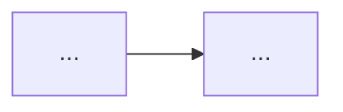

# Domain model — {{PROJECT_NAME}}

## 1. Сущности

| Сущность | Идентификатор | Persistent storage | Примечание |
|----------|----------------|---------------------|------------|
| | | | |

## 2. Связи (текстом или mermaid)

## 3. Статусы и переходы (если есть state machine)

| Из | Событие | В | Кто валидирует |
|----|---------|---|----------------|
| | | | |

## 4. On-chain vs off-chain

| Поле / сущность | Где истина |
|-----------------|------------|
| | |

## 5. Hooks

- Миграции схем БД / контрактов
